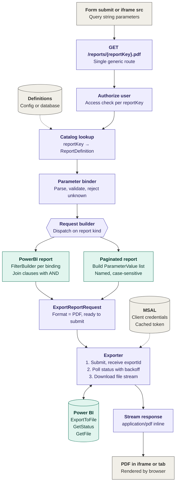
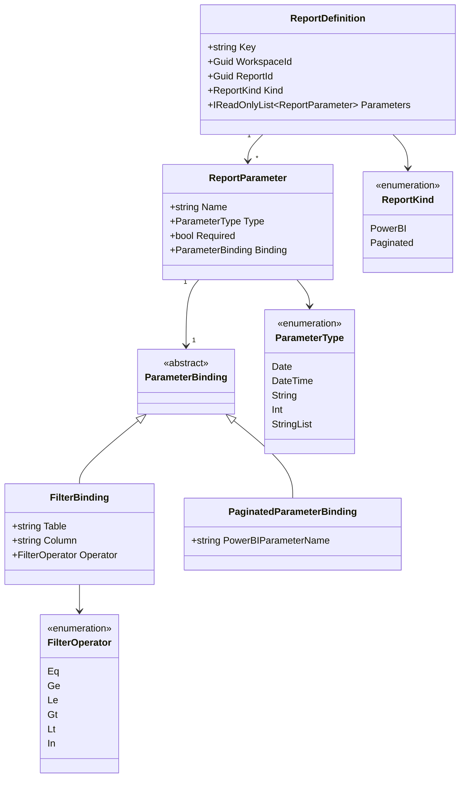
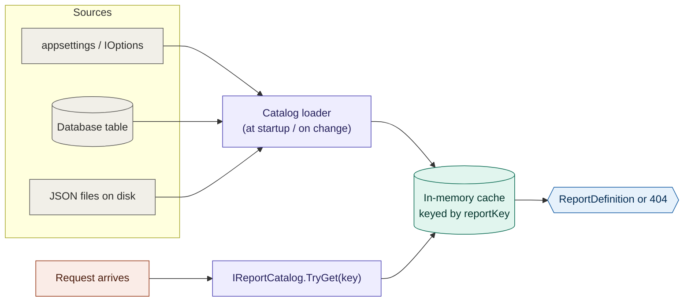
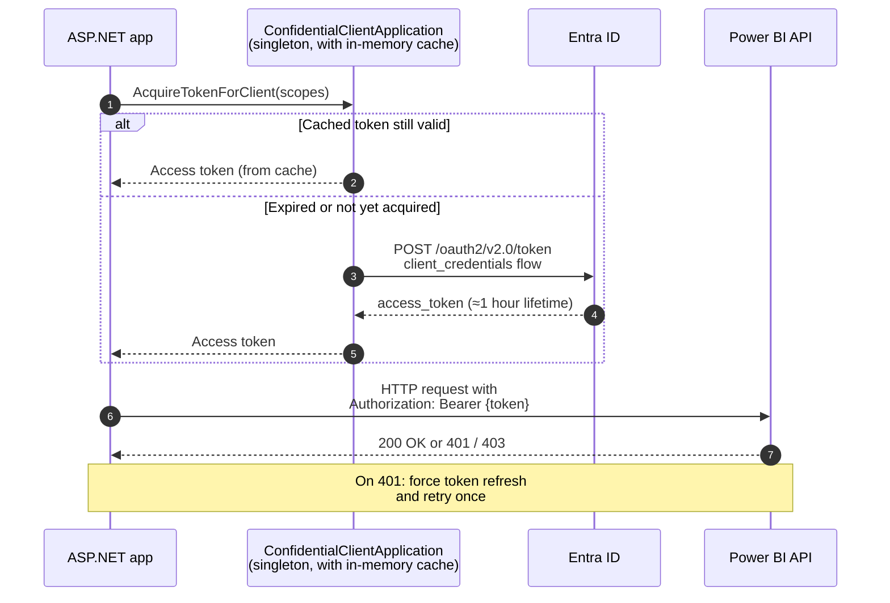
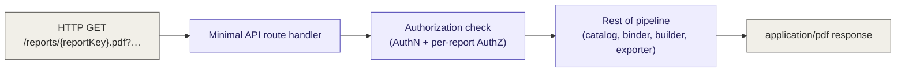
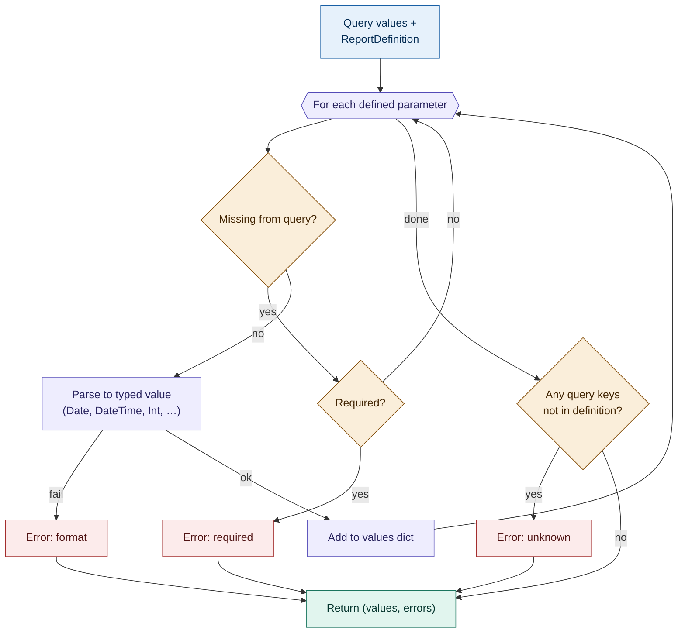
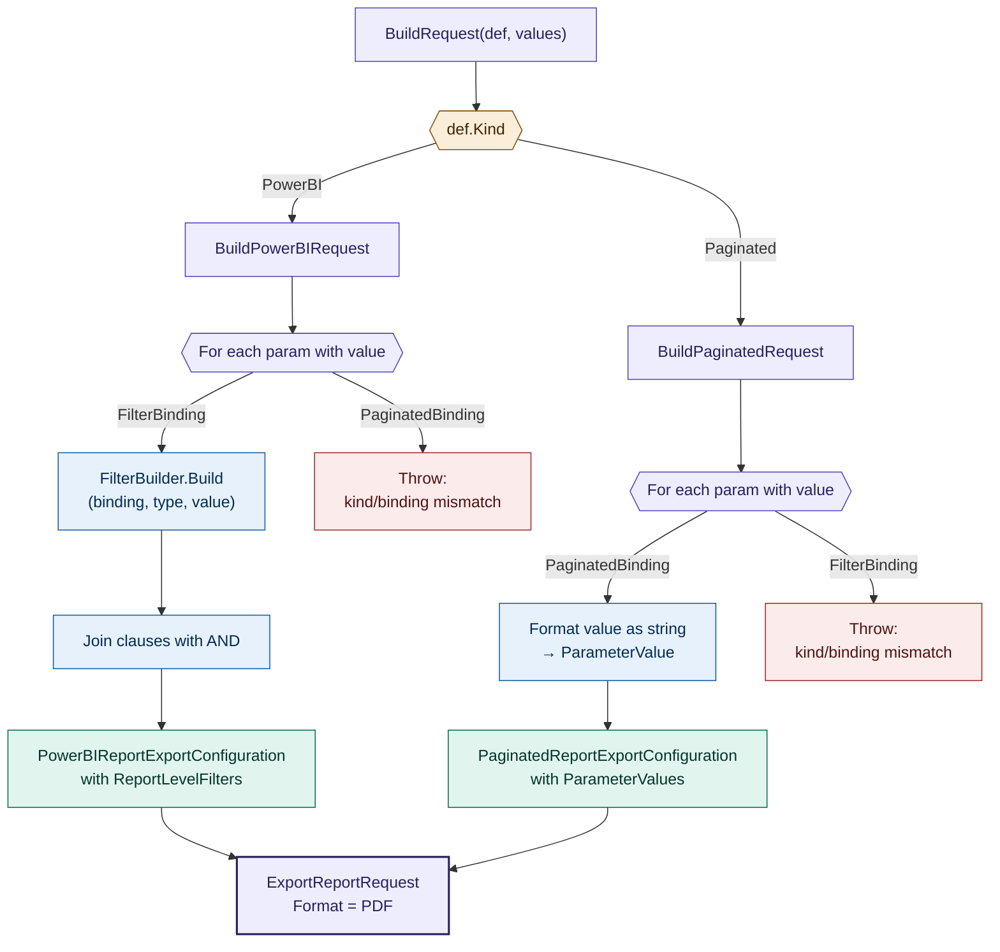
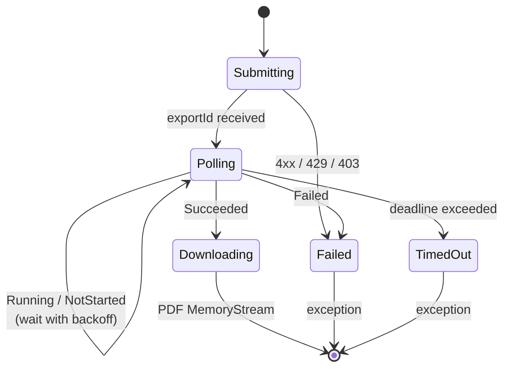
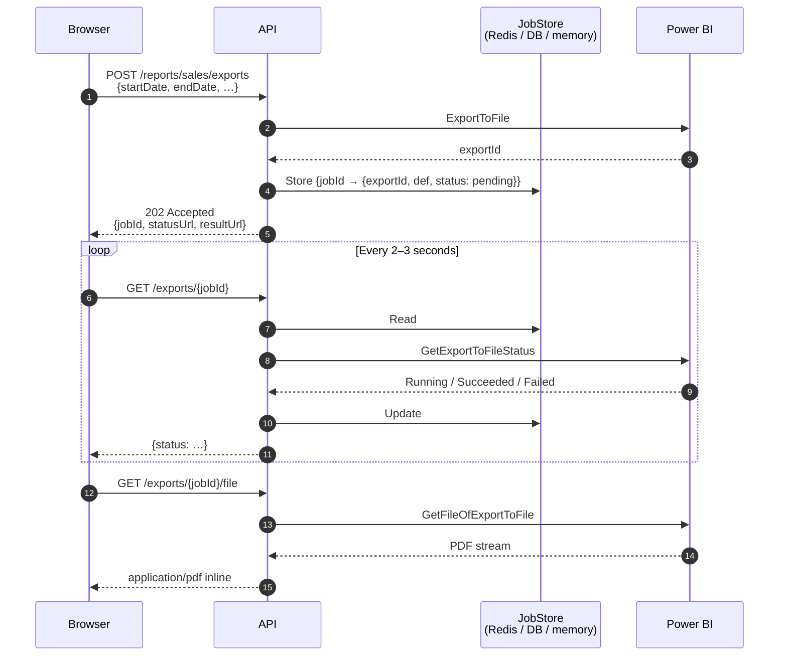

# Power BI Report PDF Endpoint — Implementation Plan

## Document purpose

This is the implementation plan for a single generic web endpoint that renders any Power BI report as a PDF, parameterised by caller-supplied inputs. The goal is **one codebase, N reports, with new reports added as configuration rather than code**.

It's written for the team doing the build. It assumes you know ASP.NET and have a rough idea of what Power BI is, but not the Power BI REST API specifically. Each major section has a diagram, concrete implementation guidance, gotchas pulled from hard-won experience, and a "questions to resolve" list.

---

## Table of contents

1. [Architecture overview](#1-architecture-overview)
2. [Prerequisites and environment setup](#2-prerequisites-and-environment-setup)
3. [Domain model](#3-domain-model)
4. [Report catalog](#4-report-catalog)
5. [Authentication and token management](#5-authentication-and-token-management)
6. [Endpoint and authorization](#6-endpoint-and-authorization)
7. [Parameter binder](#7-parameter-binder)
8. [Request builder (kind dispatch)](#8-request-builder-kind-dispatch)
9. [Exporter (submit, poll, download)](#9-exporter-submit-poll-download)
10. [Response streaming](#10-response-streaming)
11. [Optional: asynchronous two-step pattern](#11-optional-asynchronous-two-step-pattern)
12. [Discovery endpoints](#12-discovery-endpoints)
13. [Testing strategy](#13-testing-strategy)
14. [Deployment and operations](#14-deployment-and-operations)
15. [Security](#15-security)
16. [Open questions and decisions](#16-open-questions-and-decisions)
17. [Implementation order and milestones](#17-implementation-order-and-milestones)

---

## 1. Architecture overview



### 1.1 Reading the diagram

- **Grey boxes** are things outside our application's code path: the browser, the configuration store, MSAL's token cache, the Power BI service itself. They're dependencies.
- **Purple boxes** are our app's pipeline — the work that runs inside a request.
- **Teal boxes** are Power BI concerns — specific to the rendering engine behind the scenes.

### 1.2 What makes this a single endpoint rather than one per report

Three design choices collapse what could have been per-report code into one pipeline:

1. A **report definition** describes each report's parameter shape declaratively — name, type, required, how it maps to a Power BI input.
2. The **binding** (how a parameter reaches Power BI) is separated from the parameter's public identity. Rename the Power BI column or RDL parameter without touching the URL.
3. Power BI's two report kinds (standard `.pbix` and paginated `.rdl`) are handled at a single dispatch point — the request builder. Everything upstream and downstream is kind-agnostic.

### 1.3 Request lifecycle at a glance

A request walks the pipeline top-to-bottom. Roughly:

1. Browser submits a form (or an iframe's `src` is set) with a report key and query-string parameters.
2. The endpoint authorizes the caller against the report key.
3. The catalog returns the `ReportDefinition` for that key.
4. The binder converts raw string values into typed ones and validates them against the definition.
5. The request builder dispatches on `ReportDefinition.Kind` to build either filter clauses (standard Power BI) or a named parameter list (paginated).
6. The exporter submits the job, polls until complete, and downloads the PDF.
7. The response streams bytes with `Content-Type: application/pdf`; the browser renders inline.

---

## 2. Prerequisites and environment setup

### 2.1 Azure Entra ID app registration

Register an app in the Azure portal under **App registrations**. Decide up front between **service principal (SP)** auth and **user delegated** auth — this plan assumes SP throughout.

Capture:

- Tenant ID
- Application (client) ID
- Client secret (or, preferred long-term: a certificate)

Add Power BI API permissions. For read-and-export scenarios:

- `Report.Read.All`
- `Dataset.Read.All`

Grant admin consent.

### 2.2 Power BI workspace configuration

The service principal needs two things in place, and **both are easy to miss**:

1. **Power BI tenant setting enabled.** In the Power BI admin portal, under *Tenant settings → Developer settings*, find "Service principals can use Power BI APIs" and enable it. Scope it to a security group containing the app's SP; don't enable for the whole org.
2. **SP added to the workspace as a Member (or Contributor).** Open the workspace → *Access* → add the app by name with at least Member permissions.

If exports 403 with an opaque "PowerBINotAuthorizedException," one of these two is missing. The admin portal step is the more commonly forgotten of the two.

### 2.3 Capacity

**Export-to-file requires Premium, Premium Per User (PPU), or Fabric capacity** for the workspace. Shared capacity won't work. Confirm this before you start — it's a procurement/licensing conversation, not a code question, and it's blocking.

### 2.4 NuGet packages

```xml
<PackageReference Include="Microsoft.PowerBI.Api" Version="4.*" />
<PackageReference Include="Microsoft.Identity.Client" Version="4.*" />
```

### 2.5 Configuration surface

At minimum, the app needs these values (names illustrative — use your org's config conventions):

```json
{
  "PowerBI": {
    "TenantId": "…",
    "ClientId": "…",
    "ClientSecret": "…",
    "Authority": "https://login.microsoftonline.com/{tenantId}",
    "Scope": "https://analysis.windows.net/powerbi/api/.default"
  }
}
```

The client secret does not go in `appsettings.json` in a real environment — use Key Vault, user secrets locally, environment variables, or a managed identity.

### 2.6 Prerequisites checklist

- [ ] Entra app registered; tenant/client IDs noted
- [ ] Client secret (or cert) stored securely
- [ ] Power BI API permissions granted, admin consent given
- [ ] "Service principals can use Power BI APIs" enabled for the SP's security group
- [ ] SP added to the target workspace(s) as Member
- [ ] Workspace on Premium / PPU / Fabric capacity confirmed
- [ ] Test report IDs identified (one `.pbix`, one paginated `.rdl` if both kinds are in scope)
- [ ] NuGet packages added to the project
- [ ] Config values wired through DI

### 2.7 Questions to resolve

- **Cert vs secret for SP auth?** Certs are longer-lived and auditable; secrets are simpler. Certs preferred for production.
- **Is there an existing SP we should reuse, or do we create a new one scoped to this app?** Shared SPs complicate auditing; a dedicated one is cleaner.
- **Which workspace(s) does this endpoint need access to?** Multiple workspaces is fine but each needs the SP added.
- **Who in the org owns the admin-portal tenant setting?** You'll need them to enable it.

---

## 3. Domain model

This is the type hierarchy that drives every other part of the system. Get this right first — it's hard to refactor later.



### 3.1 C# record definitions

```csharp
public record ReportDefinition(
    string Key,
    Guid WorkspaceId,
    Guid ReportId,
    ReportKind Kind,
    IReadOnlyList<ReportParameter> Parameters);

public record ReportParameter(
    string Name,
    ParameterType Type,
    bool Required,
    ParameterBinding Binding);

[JsonPolymorphic(TypeDiscriminatorPropertyName = "$type")]
[JsonDerivedType(typeof(FilterBinding),             "filter")]
[JsonDerivedType(typeof(PaginatedParameterBinding), "paginated")]
public abstract record ParameterBinding;

public record FilterBinding(
    string Table,
    string Column,
    FilterOperator Operator) : ParameterBinding;

public record PaginatedParameterBinding(
    string PowerBIParameterName) : ParameterBinding;

public enum ReportKind     { PowerBI, Paginated }
public enum ParameterType  { Date, DateTime, String, Int, StringList }
public enum FilterOperator { Eq, Ge, Le, Gt, Lt, In }
```

### 3.2 Worked example: standard Power BI report

```json
{
  "key": "sales-dashboard",
  "workspaceId": "a1b2c3d4-1111-2222-3333-444455556666",
  "reportId":    "f9e8d7c6-aaaa-bbbb-cccc-ddddeeeeffff",
  "kind": "PowerBI",
  "parameters": [
    { "name": "startDate", "type": "Date", "required": true,
      "binding": { "$type": "filter", "table": "Sales", "column": "OrderDate", "operator": "Ge" } },
    { "name": "endDate",   "type": "Date", "required": true,
      "binding": { "$type": "filter", "table": "Sales", "column": "OrderDate", "operator": "Le" } },
    { "name": "region",    "type": "StringList", "required": false,
      "binding": { "$type": "filter", "table": "Sales", "column": "Region", "operator": "In" } },
    { "name": "category",  "type": "String", "required": false,
      "binding": { "$type": "filter", "table": "Product", "column": "Category", "operator": "Eq" } }
  ]
}
```

### 3.3 Worked example: paginated report

```json
{
  "key": "invoice",
  "workspaceId": "a1b2c3d4-1111-2222-3333-444455556666",
  "reportId":    "11112222-3333-4444-5555-666677778888",
  "kind": "Paginated",
  "parameters": [
    { "name": "invoiceNumber", "type": "String", "required": true,
      "binding": { "$type": "paginated", "powerBIParameterName": "InvoiceNumber" } },
    { "name": "asOfDate",      "type": "Date",   "required": true,
      "binding": { "$type": "paginated", "powerBIParameterName": "AsOfDate" } }
  ]
}
```

### 3.4 Why bindings are separated from parameters

Notice the asymmetry: the public parameter name (`startDate`, `invoiceNumber`) is decoupled from the Power BI identifier (`Sales/OrderDate`, `InvoiceNumber`). This is deliberate:

- Power BI authors can rename columns or RDL parameters without breaking the URL surface.
- Two reports can both expose `startDate` even if one binds to `Sales/OrderDate` and the other to `Inventory/AsOfDate`.
- Testing becomes easier — binding logic is a pure function of `(binding, type, value)`.

### 3.5 Gotchas

- **Polymorphic deserialization.** With `System.Text.Json` in .NET 7+, `[JsonPolymorphic]` plus `[JsonDerivedType]` is required; earlier versions need a custom converter. Verify this works end-to-end with a round-trip test before relying on it.
- **Enum casing in JSON.** Decide whether JSON uses `"PowerBI"` or `"powerbi"`. Configure `JsonSerializerOptions.Converters.Add(new JsonStringEnumConverter())` and be consistent. The examples in this doc use the C# PascalCase form.
- **Record equality.** Records use value equality by default — convenient for tests, but don't rely on it if `Parameters` is a mutable list. Use `IReadOnlyList<T>` and immutable collections.

### 3.6 Questions to resolve

- Does any real report need a **parameter with two filter clauses** (e.g. `startDate` that maps to both `OrderDate ge` *and* `ShipDate ge`)? If yes, a binding needs to become a list, not a single object. Current design assumes 1:1.
- Do we need **default values** on parameters? The current design has no defaults — missing optional params are simply absent from the filter. If we want "last 30 days by default," that's a schema change.
- Do we need **multi-value paginated parameters** (one RDL param accepting multiple values)? The builder needs to know to expand a `StringList` into multiple `ParameterValue` entries with the same `Name`.

---

## 4. Report catalog

The catalog is where report definitions live and how they're retrieved at request time. It's a small abstraction but deserves deliberate design because it's touched by every request.



### 4.1 Interface

```csharp
public interface IReportCatalog
{
    bool TryGet(string reportKey, out ReportDefinition definition);
    IReadOnlyList<ReportDefinition> All();
}
```

`All()` is for the discovery endpoint (section 12). Keep it read-only — mutation happens through the loader, not the interface.

### 4.2 Implementation options

#### 4.2.1 Config-backed (simplest)

If the set of reports changes about as often as the code does, store them in `appsettings.json` under a `Reports` array and bind with the options pattern. Use `IOptionsMonitor<ReportCatalogOptions>` so config reloads refresh the catalog for free.

**Pros:** No database. Version-controlled with the code. Trivial to set up.
**Cons:** Report authors (often BI team) can't add reports without a deploy.

#### 4.2.2 Database-backed

Single table, rows keyed on `Key`, with a JSON column storing the rest of the definition. Read all rows at startup into an in-memory dictionary; refresh on a timer or on change notification.

**Pros:** Non-developers can add reports via a small admin UI.
**Cons:** Extra infrastructure; needs an admin UI or CLI.

#### 4.2.3 File-per-report on disk

One JSON file per report under a known directory. Watch the directory and rebuild the cache on changes.

**Pros:** Trivially auditable (git the directory). No DB.
**Cons:** Deployment has to include the files; less discoverable than a DB row.

### 4.3 Caching strategy

Whichever storage you pick, **the in-memory dictionary is the source of truth during a request**. Don't hit the DB or filesystem per request.

- Load at startup.
- Refresh on change (`IOptionsMonitor`, `FileSystemWatcher`, or a poll).
- `TryGet` is O(1) dictionary lookup.

### 4.4 Gotchas

- **Key collisions.** Enforce uniqueness of `Key` at load time. Fail the startup loudly if two definitions share a key — silent last-wins is a bad surprise.
- **Validation at load time, not request time.** Validate the shape of each definition when loading: parameter names are unique within a report, bindings match the report kind (filter bindings on PowerBI, paginated bindings on Paginated), operators are compatible with parameter types. Failing early turns a bad deployment into a startup error instead of a mystery at runtime.
- **Hot reload vs. in-flight requests.** If you swap the catalog dictionary while a request is mid-processing, that request sees a consistent snapshot — fine. Just don't mutate the dictionary in place.

### 4.5 Questions to resolve

- **Where do definitions live?** See 4.2. This is the first concrete decision for the project.
- **Who can add/modify them?** Governs whether you need an admin UI.
- **How are definitions versioned when reports evolve?** If someone renames a column in Power BI, the definition's binding needs to update. Is there a process?
- **Environment separation.** Dev/staging/prod probably point at different workspaces. Does the catalog vary per environment, or does it carry all environments' IDs in one place?

---

## 5. Authentication and token management

The whole pipeline depends on a valid Power BI access token. Getting this wrong is a recurring source of bugs — especially "works on my machine, fails in prod" problems driven by token caching not being reused.



### 5.1 Setup

Register the `ConfidentialClientApplication` **as a singleton** at app startup. The in-memory token cache lives on that instance; creating a new instance per request throws the cache away and pounds Entra with token requests.

```csharp
services.AddSingleton<IConfidentialClientApplication>(sp =>
{
    var opts = sp.GetRequiredService<IOptions<PowerBIOptions>>().Value;
    return ConfidentialClientApplicationBuilder
        .Create(opts.ClientId)
        .WithClientSecret(opts.ClientSecret)
        .WithAuthority(new Uri(opts.Authority))
        .Build();
});
```

### 5.2 Acquiring a token

```csharp
public class PowerBIClientFactory : IPowerBIClientFactory
{
    private readonly IConfidentialClientApplication _app;
    private readonly string[] _scopes;

    public PowerBIClientFactory(
        IConfidentialClientApplication app,
        IOptions<PowerBIOptions> opts)
    {
        _app = app;
        _scopes = new[] { opts.Value.Scope };
    }

    public async Task<PowerBIClient> CreateAsync(CancellationToken ct)
    {
        var result = await _app.AcquireTokenForClient(_scopes).ExecuteAsync(ct);
        var creds  = new TokenCredentials(result.AccessToken, "Bearer");
        return new PowerBIClient(new Uri("https://api.powerbi.com/"), creds);
    }
}
```

### 5.3 Token lifetime and refresh

MSAL handles refresh automatically **if you reuse the same instance**. `AcquireTokenForClient` returns the cached token until it's near expiry, then fetches a new one silently. The app's code does not need to track expiry itself.

If a call to Power BI returns `401 Unauthorized`, that usually means the cached token was invalidated server-side (e.g. the SP's permissions changed). Catch 401 once, force a cache-ignoring refresh (`.WithForceRefresh(true)`), and retry exactly once.

### 5.4 Gotchas

- **Singleton, not scoped.** The MSAL app and its cache must be a singleton. Scoped means per-request, which means no cache reuse across requests.
- **Scope string.** The scope is `https://analysis.windows.net/powerbi/api/.default`. The `.default` suffix is required for client-credentials flow; without it you get a confusing auth error.
- **Certificate auth is preferred for production.** Replace `WithClientSecret` with `WithCertificate(X509Certificate2)` when moving to prod. Secrets rotate; certs can be issued from a CA and audited.
- **Clock skew.** If the server time is off, token validation fails. Rare on cloud VMs; worth knowing.
- **Managed Identity alternative.** If the app runs on Azure (App Service, AKS, VM), consider `DefaultAzureCredential` / Managed Identity instead of a client secret. Same Power BI permissions model, no secrets to store.

### 5.5 Questions to resolve

- **Secret, cert, or managed identity?** Target state is almost always cert or managed identity; secret is pragmatic for early development.
- **Where is the secret/cert stored?** Key Vault, env vars, or mounted secret?
- **Single SP for all environments, or one per environment?** One per is cleaner for auditing.

---

## 6. Endpoint and authorization

The HTTP surface is small: a single route, plus a discovery companion (section 12).



### 6.1 Route handler

```csharp
app.MapGet("/reports/{reportKey}.pdf", async (
        string reportKey,
        HttpRequest req,
        IReportCatalog catalog,
        IReportAuthorizer authorizer,
        IReportPipeline pipeline,
        HttpResponse resp,
        CancellationToken ct) =>
    {
        if (!catalog.TryGet(reportKey, out var def))
            return Results.NotFound();

        if (!await authorizer.CanAccessAsync(req.HttpContext.User, def, ct))
            return Results.Forbid();

        var result = await pipeline.RunAsync(def, req.Query, ct);

        return result.Match(
            pdf => StreamPdf(resp, reportKey, pdf),
            errors => Results.ValidationProblem(errors));
    })
    .RequireAuthorization();
```

`IReportPipeline.RunAsync` returns a discriminated result (`PdfStream` on success, `validation errors` on bad input). Pick whatever `OneOf<T,U>` or tuple shape your codebase prefers.

### 6.2 Authentication vs authorization

Two separate concerns:

- **Authentication (who is this?):** Standard ASP.NET — cookie auth, OIDC, bearer, whatever the broader app uses. `[Authorize]` / `.RequireAuthorization()` on the route.
- **Authorization (can this user see this report?):** Custom. Keyed on `reportKey` and the authenticated principal. Implementations vary — group membership, per-report ACL, tenant scoping.

```csharp
public interface IReportAuthorizer
{
    Task<bool> CanAccessAsync(
        ClaimsPrincipal user,
        ReportDefinition definition,
        CancellationToken ct);
}
```

### 6.3 The trust boundary

**This endpoint is the security boundary, not Power BI.** The service principal has access to the whole workspace. Whatever row-level security or access control the report would enforce for an end user *if they hit Power BI directly* is bypassed by the SP.

That means:

- Authorize every request against the `reportKey` before calling the pipeline.
- If the report contains data for multiple tenants/customers, **inject a tenant filter the caller can't override** (see section 15).
- Audit every request: who asked for what, with which parameters, when.

### 6.4 Gotchas

- **`[Authorize]` alone is not enough.** It proves *who* the user is, not *what they can see*. The per-report check is the piece that stops one customer requesting another's report.
- **HTTP method choice.** `GET` is right for "render and return a PDF" — it's idempotent, cacheable, and works for iframe `src` and new-tab links. Reserve `POST` for the async pattern (section 11) where you're creating a job.
- **Query string size limits.** Defaults around 2 KB in IIS, more on Kestrel. A report with many `region=…` values can bump the limit. Not usually a problem, but worth noting.

### 6.5 Questions to resolve

- **Authentication scheme?** Likely inherited from the surrounding app.
- **Authorization model?** Per-report ACL, group-based, tenant-scoped, some combination?
- **Audit sink?** Application Insights, a log aggregator, a dedicated audit table?

---

## 7. Parameter binder

The binder is the piece that earns its keep by catching bad input early, with structured errors, before we waste a Power BI capacity slot on a request that can't succeed.



### 7.1 Signature

```csharp
public static (
    Dictionary<string, object?> Values,
    Dictionary<string, string[]> Errors)
    Bind(ReportDefinition def, IQueryCollection query);
```

Returns both sides explicitly. `Errors.Count > 0` means reject the request with `400 ValidationProblem`; otherwise `Values` is the typed dictionary passed to the request builder.

### 7.2 Type conversion table

| `ParameterType` | Parsed via | Input examples |
|---|---|---|
| `Date` | `DateOnly.Parse(s, InvariantCulture)` | `"2024-01-01"` |
| `DateTime` | `DateTime.Parse(s, InvariantCulture, RoundtripKind)` | `"2024-01-01T12:00:00Z"` |
| `Int` | `int.Parse(s, InvariantCulture)` | `"1000"` |
| `String` | `s.ToString()` | any |
| `StringList` | `StringValues.ToArray()` | repeated query key or comma-separated, pick one convention |

**`CultureInfo.InvariantCulture` everywhere** — otherwise a server in a French locale will reject `"2024-01-01"` because it expects `"01/01/2024"`.

### 7.3 Reference implementation

```csharp
public static class ParameterBinder
{
    public static (Dictionary<string, object?> Values, Dictionary<string, string[]> Errors)
        Bind(ReportDefinition def, IQueryCollection query)
    {
        var values = new Dictionary<string, object?>(StringComparer.OrdinalIgnoreCase);
        var errors = new Dictionary<string, string[]>();

        foreach (var p in def.Parameters)
        {
            var raw = query[p.Name];

            if (raw.Count == 0)
            {
                if (p.Required)
                    errors[p.Name] = new[] { "Required." };
                continue;
            }

            try
            {
                values[p.Name] = Convert(p.Type, raw);
            }
            catch (FormatException ex)
            {
                errors[p.Name] = new[] { ex.Message };
            }
        }

        // Reject unknown parameters so typos fail loudly.
        var known = def.Parameters
            .Select(p => p.Name)
            .ToHashSet(StringComparer.OrdinalIgnoreCase);

        foreach (var key in query.Keys.Where(k => !known.Contains(k)))
            errors[key] = new[] { "Unknown parameter." };

        return (values, errors);
    }

    private static object Convert(ParameterType type, StringValues raw) => type switch
    {
        ParameterType.Date       => DateOnly.Parse(raw!, CultureInfo.InvariantCulture),
        ParameterType.DateTime   => DateTime.Parse(raw!, CultureInfo.InvariantCulture,
                                                   DateTimeStyles.RoundtripKind),
        ParameterType.Int        => int.Parse(raw!, CultureInfo.InvariantCulture),
        ParameterType.String     => raw.ToString(),
        ParameterType.StringList => raw.ToArray(),
        _ => throw new NotSupportedException($"Unsupported type: {type}")
    };
}
```

### 7.4 Error response shape

Use ASP.NET's built-in `ValidationProblem`:

```json
{
  "type": "https://tools.ietf.org/html/rfc7231#section-6.5.1",
  "title": "One or more validation errors occurred.",
  "status": 400,
  "errors": {
    "startDate": ["Required."],
    "region":    ["Unknown parameter."]
  }
}
```

The frontend can map `errors` back to fields and highlight them.

### 7.5 Gotchas

- **Culture.** Already mentioned; always `InvariantCulture`. Also avoid `DateTime.Now`-style defaults here; parameters either come from the caller or don't.
- **Case sensitivity.** HTTP query keys are case-insensitive by convention. Use `StringComparer.OrdinalIgnoreCase` on both the `known` set and the `values` dict so `startDate` and `startdate` resolve to the same parameter. Whether values (like region names) are case-sensitive is a separate question, answered by the target column.
- **Unknown rejection vs forward compatibility.** Rejecting unknowns is strict. If you ever want URLs to carry tracking params (e.g. `?utm_source=…`), allowlist a prefix like `_` as permitted-unknown.
- **`StringList` conventions.** Pick *one* — repeated keys (`?region=West&region=East`) or comma-separated (`?region=West,East`) — and stick with it. Repeated keys are idiomatic for query strings and easier to URL-encode.
- **Bounds checks.** The binder validates *format*, not *value*. `endDate` before `startDate` is a semantic check; either add it as a post-binding validator or leave it to Power BI to return an empty report.

### 7.6 Questions to resolve

- **Date-only vs DateTime-only?** Most reports want dates. Mixing is fine but adds surface area.
- **Any parameter types beyond the listed five?** `Decimal` and `Bool` are plausible. Add only when a real report needs them.
- **Cross-parameter semantic validation?** e.g. `startDate <= endDate`. Yes/no; if yes, where does it live?

---

## 8. Request builder (kind dispatch)

The request builder is where the generic pipeline meets Power BI's two-kinds-of-report reality. There are **two layers of dispatch**:

1. **Outer:** `ReportDefinition.Kind` → pick `BuildPowerBIRequest` or `BuildPaginatedRequest`.
2. **Inner:** each parameter's `Binding` type → format as a filter clause or a `ParameterValue`.



### 8.1 Outer dispatch

```csharp
public ExportReportRequest BuildRequest(
    ReportDefinition def,
    IDictionary<string, object?> values)
    => def.Kind switch
    {
        ReportKind.PowerBI   => BuildPowerBIRequest(def, values),
        ReportKind.Paginated => BuildPaginatedRequest(def, values),
        _ => throw new NotSupportedException($"Unknown report kind: {def.Kind}")
    };
```

### 8.2 Power BI branch

```csharp
private static ExportReportRequest BuildPowerBIRequest(
    ReportDefinition def,
    IDictionary<string, object?> values)
{
    var clauses = new List<string>();

    foreach (var p in def.Parameters)
    {
        if (!values.TryGetValue(p.Name, out var v) || v is null) continue;

        var clause = p.Binding switch
        {
            FilterBinding fb =>
                FilterBuilder.Build(fb, p.Type, v),

            PaginatedParameterBinding =>
                throw new InvalidOperationException(
                    $"Parameter '{p.Name}' has a paginated binding " +
                    $"in PowerBI report '{def.Key}'."),

            _ => throw new NotSupportedException(
                $"Unknown binding: {p.Binding.GetType().Name}")
        };

        clauses.Add(clause);
    }

    return new ExportReportRequest
    {
        Format = FileFormat.PDF,
        PowerBIReportConfiguration = clauses.Count == 0 ? null : new()
        {
            ReportLevelFilters = new List<ExportFilter>
            {
                new(string.Join(" and ", clauses))
            }
        }
    };
}
```

### 8.3 Paginated branch

```csharp
private static ExportReportRequest BuildPaginatedRequest(
    ReportDefinition def,
    IDictionary<string, object?> values)
{
    var parameters = new List<ParameterValue>();

    foreach (var p in def.Parameters)
    {
        if (!values.TryGetValue(p.Name, out var v) || v is null) continue;

        switch (p.Binding)
        {
            case PaginatedParameterBinding pb:
                parameters.Add(new ParameterValue
                {
                    Name  = pb.PowerBIParameterName,
                    Value = FormatForPaginated(p.Type, v)
                });
                break;

            case FilterBinding:
                throw new InvalidOperationException(
                    $"Parameter '{p.Name}' has a filter binding " +
                    $"in paginated report '{def.Key}'.");

            default:
                throw new NotSupportedException(
                    $"Unknown binding: {p.Binding.GetType().Name}");
        }
    }

    return new ExportReportRequest
    {
        Format = FileFormat.PDF,
        PaginatedReportConfiguration = new PaginatedReportExportConfiguration
        {
            ParameterValues = parameters
        }
    };
}

private static string FormatForPaginated(ParameterType type, object value) => (type, value) switch
{
    (ParameterType.Date,     DateOnly d)  => d.ToString("yyyy-MM-dd"),
    (ParameterType.DateTime, DateTime dt) => dt.ToString("yyyy-MM-ddTHH:mm:ss",
                                                         CultureInfo.InvariantCulture),
    (ParameterType.Int,      int i)       => i.ToString(CultureInfo.InvariantCulture),
    (ParameterType.String,   string s)    => s,
    (ParameterType.StringList, _)         => throw new NotSupportedException(
        "StringList needs expansion — handle at the caller."),
    _ => throw new NotSupportedException($"Can't format {type}.")
};
```

### 8.4 The FilterBuilder

Centralises the surprisingly finicky Power BI filter syntax:

```csharp
public static class FilterBuilder
{
    public static string Build(FilterBinding b, ParameterType type, object value)
    {
        var target = $"{EncodeIdentifier(b.Table)}/{EncodeIdentifier(b.Column)}";
        return (b.Operator, type, value) switch
        {
            (FilterOperator.Ge, ParameterType.Date,     DateOnly d) =>
                $"{target} ge datetime'{d:yyyy-MM-dd}T00:00:00'",
            (FilterOperator.Le, ParameterType.Date,     DateOnly d) =>
                $"{target} le datetime'{d:yyyy-MM-dd}T23:59:59'",
            (FilterOperator.Ge, ParameterType.DateTime, DateTime dt) =>
                $"{target} ge datetime'{dt:yyyy-MM-ddTHH:mm:ss}'",
            (FilterOperator.Le, ParameterType.DateTime, DateTime dt) =>
                $"{target} le datetime'{dt:yyyy-MM-ddTHH:mm:ss}'",
            (FilterOperator.Eq, ParameterType.String,   string s) =>
                $"{target} eq '{Escape(s)}'",
            (FilterOperator.Eq, ParameterType.Int,      int i) =>
                $"{target} eq {i.ToString(CultureInfo.InvariantCulture)}",
            (FilterOperator.Ge, ParameterType.Int,      int i) =>
                $"{target} ge {i.ToString(CultureInfo.InvariantCulture)}",
            (FilterOperator.In, ParameterType.StringList, string[] xs) =>
                $"{target} in ({string.Join(", ", xs.Select(x => $"'{Escape(x)}'"))})",
            // extend with further (operator, type) combinations as needed
            _ => throw new NotSupportedException(
                $"Unsupported combo: {b.Operator} / {type} / {value.GetType().Name}")
        };
    }

    private static string Escape(string s) => s.Replace("'", "''");

    // Column/table names with spaces require "_x0020_" per Power BI filter syntax.
    private static string EncodeIdentifier(string s) => s.Replace(" ", "_x0020_");
}
```

### 8.5 Power BI filter syntax reference

| Concept | Syntax |
|---|---|
| Table/column separator | `Sales/Region` (forward slash, not `.`) |
| String literal | `'West'` (single quotes) |
| Escaping a quote | `'O''Brien'` (double the quote) |
| Number literal | `1000` (bare) |
| Date/time literal | `datetime'2024-01-01T00:00:00'` |
| Multi-value `in` | `Sales/Region in ('West', 'East')` |
| Combining clauses | `and`, `or` (lowercase), group with `(…)` |
| Space in identifier | `My_x0020_Column` (encoded) |

### 8.6 Gotchas

- **Cross-validation matters.** If a PowerBI report definition has a paginated binding (or vice versa), throw at build time. Silently skipping the mismatched parameter produces reports with missing filters — worse than an error.
- **`null` filter config is allowed.** If no filters are supplied, the `PowerBIReportConfiguration` can be `null` — the report runs with its defaults. Don't construct a `PowerBIReportConfiguration` with an empty `ReportLevelFilters` list; that behaves differently on some SDK versions.
- **Case sensitivity in paginated parameters.** `Name` must match the RDL parameter exactly, respecting case. `invoiceNumber` ≠ `InvoiceNumber`. This is why the binding explicitly carries `PowerBIParameterName` — the public name stays camelCase.
- **Date inclusivity.** `le datetime'2024-12-31T00:00:00'` excludes almost all of December 31. The Date branch uses `T23:59:59` to cover the full day; DateTime passes through as-is.
- **Culture in ToString.** `dt.ToString("yyyy-MM-ddTHH:mm:ss")` is safe (format string is explicit), but `i.ToString()` without `InvariantCulture` can emit a thousands separator in some locales. Always pass invariant.

### 8.7 Questions to resolve

- **Operators beyond Eq/Ge/Le/In?** Less-than/greater-than are trivial to add. `between` doesn't exist — use two clauses.
- **`or` within a filter?** Everything joined with `and` covers the common case. If a single report needs `(A or B) and C`, the binding shape needs a group concept.
- **Null handling on optional columns?** Power BI filters with `eq null` work, but our current binding shape has no way to express "is null" distinct from "not supplied". Deferred.

---

## 9. Exporter (submit, poll, download)

The exporter is where the asynchronous nature of Power BI export bites. A request isn't a single HTTP call — it's three: submit, poll (repeatedly), download.



### 9.1 Interface

```csharp
public interface IReportExporter
{
    Task<Stream> ExportAsync(
        ReportDefinition def,
        IDictionary<string, object?> values,
        CancellationToken ct);
}
```

### 9.2 Reference implementation (synchronous — for reports that finish fast)

```csharp
public class ReportExporter : IReportExporter
{
    private readonly IPowerBIClientFactory _factory;
    private readonly IRequestBuilder _builder;
    private readonly ILogger<ReportExporter> _log;

    // Tuning knobs — move to options if they vary by environment.
    private static readonly TimeSpan InitialDelay = TimeSpan.FromSeconds(2);
    private static readonly TimeSpan MaxDelay     = TimeSpan.FromSeconds(10);
    private static readonly TimeSpan Timeout      = TimeSpan.FromMinutes(5);
    private const double BackoffMultiplier        = 1.5;

    public async Task<Stream> ExportAsync(
        ReportDefinition def,
        IDictionary<string, object?> values,
        CancellationToken ct)
    {
        var request = _builder.BuildRequest(def, values);

        using var client = await _factory.CreateAsync(ct);

        // 1. Submit
        var export = await client.Reports.ExportToFileInGroupAsync(
            def.WorkspaceId, def.ReportId, request, ct);

        // 2. Poll
        var delay    = InitialDelay;
        var deadline = DateTime.UtcNow.Add(Timeout);
        var status   = export;

        while (status.Status is ExportState.Running or ExportState.NotStarted)
        {
            if (DateTime.UtcNow > deadline)
                throw new TimeoutException(
                    $"Export of '{def.Key}' timed out after {Timeout}.");

            await Task.Delay(delay, ct);
            delay = TimeSpan.FromSeconds(
                Math.Min(delay.TotalSeconds * BackoffMultiplier,
                         MaxDelay.TotalSeconds));

            status = await client.Reports.GetExportToFileStatusInGroupAsync(
                def.WorkspaceId, def.ReportId, export.Id, ct);
        }

        if (status.Status != ExportState.Succeeded)
            throw new InvalidOperationException(
                $"Export failed with status {status.Status}.");

        // 3. Download — copy to MemoryStream so the caller can dispose the client.
        var source = await client.Reports.GetFileOfExportToFileInGroupAsync(
            def.WorkspaceId, def.ReportId, export.Id, ct);

        var ms = new MemoryStream();
        await source.CopyToAsync(ms, ct);
        ms.Position = 0;
        return ms;
    }
}
```

### 9.3 Polling strategy

- **Start at 2 seconds, multiply by 1.5 each iteration, cap at 10 seconds.** Avoids both hammering Power BI for fast reports and napping for long periods on slow ones.
- **Overall deadline of ~5 minutes.** Any report that genuinely takes longer should move to the async two-step pattern (section 11).
- **Honor the caller's `CancellationToken`.** If they disconnect, bail out rather than continuing to poll.
- **Don't rely on `Retry-After` from the SDK.** The raw HTTP `Retry-After` header is present but the SDK doesn't always surface it cleanly. A simple bounded-exponential backoff is good enough.

### 9.4 Error handling

| Condition | What the SDK throws / returns | Response |
|---|---|---|
| 401 Unauthorized | `HttpOperationException` status 401 | Force-refresh token, retry once. |
| 403 Forbidden | `HttpOperationException` status 403 | Check SP permissions — usually misconfiguration, not transient. |
| 404 Not Found | `HttpOperationException` status 404 | Workspace or report ID is wrong — config problem. |
| 429 Too Many Requests | `HttpOperationException` status 429 | Back off longer, or return "try again shortly" to caller. |
| Export status `Failed` | `ExportState.Failed` | Report-side problem (bad filter, model error). Log the full status response — it often has a `Message`. |
| Timeout | Our own `TimeoutException` | 504 to caller, or suggest async pattern. |

### 9.5 Gotchas

- **Capacity requirement.** Export-to-file requires Premium/PPU/Fabric. Shared capacity 403s with a message that looks like a permission issue but isn't.
- **Stream lifetime.** `GetFileOfExportToFile…` returns a stream backed by the HTTP response. Copy to `MemoryStream` before disposing the `PowerBIClient`, or you'll hand the caller a stream that fails on read. Worth a line of comment since it looks unnecessary at first glance.
- **`InGroup` vs. non-`InGroup` methods.** For any real workspace, always call the `…InGroupAsync` variants (which take `workspaceId`). The non-`InGroup` variants only work against "My Workspace."
- **Rate limits are per capacity, per hour.** The exact numbers vary by SKU and shift over time; check the current docs. Under bursty load, batch or queue.
- **Polling frequency and capacity.** Polling itself is cheap, but during 429 windows, pause rather than retrying immediately.
- **Large PDFs and memory.** `MemoryStream` holds the whole PDF in RAM. For >100 MB reports, stream to a temp file and return a `FileStream` instead.

### 9.6 Questions to resolve

- **What's the expected p50/p95 export time per report?** Drives sync vs async decision.
- **How many concurrent exports do we expect peak?** Drives capacity sizing and rate-limit handling.
- **Should we cache rendered PDFs?** By `(reportId, parameter hash, validity window)` — can save a lot of capacity for repeat runs of the same report with the same inputs.

---

## 10. Response streaming

Compared to the rest of the pipeline, this is simple — but there are two small things worth getting right.

### 10.1 Writing the response

```csharp
private static IResult StreamPdf(HttpResponse resp, string reportKey, Stream pdf)
{
    resp.Headers["Content-Disposition"] = $"inline; filename=\"{reportKey}.pdf\"";
    return Results.File(pdf, "application/pdf", enableRangeProcessing: true);
}
```

### 10.2 `inline` vs `attachment`

- **`inline`:** Browser renders the PDF in the tab or iframe. This is what we want.
- **`attachment`:** Browser downloads the PDF to disk.

`Results.File` with a filename defaults to `attachment`. Setting the header explicitly overrides that. For an iframe embed the header doesn't matter (iframes render whatever mime-type they're given); for a new tab it very much does — without `inline`, the tab briefly opens and then downloads, which is the opposite of the intended UX.

### 10.3 Range processing

`enableRangeProcessing: true` lets the browser's PDF viewer request byte ranges, which is what enables smooth scrolling in long PDFs without downloading the whole file upfront. For small PDFs it has no visible effect; for large ones it's a meaningful UX win.

### 10.4 Gotchas

- **Quote the filename.** If `reportKey` ever contains a space, the unquoted filename breaks the header.
- **Stream is one-shot.** The `Stream` returned by the exporter is consumed by the response. Don't try to read from it twice.
- **Compression.** Response compression (gzip, brotli) on `application/pdf` is usually a waste — PDFs are already compressed internally. Exclude `application/pdf` from response compression middleware.

---

## 11. Optional: asynchronous two-step pattern

Use this when reports regularly exceed ~15 seconds. It turns one long-running request into a short "submit" and a short "check/download," with better UX and browser-timeout resilience.



### 11.1 Endpoints

```csharp
// Start
app.MapPost("/reports/{reportKey}/exports",
    async (string reportKey, ExportRequestDto dto, IExportJobs jobs, …) =>
{
    var jobId = await jobs.StartAsync(reportKey, dto, ct);
    return Results.Accepted(
        $"/reports/{reportKey}/exports/{jobId}",
        new { jobId });
});

// Status
app.MapGet("/reports/{reportKey}/exports/{jobId}",
    async (string jobId, IExportJobs jobs, …) =>
{
    var state = await jobs.GetAsync(jobId, ct);
    return state switch
    {
        { Status: JobStatus.Pending }    => Results.Ok(new { status = "pending" }),
        { Status: JobStatus.Succeeded }  => Results.Ok(new {
            status = "succeeded",
            downloadUrl = $"/reports/{state.ReportKey}/exports/{jobId}/file" }),
        { Status: JobStatus.Failed, Error: var e } => Results.Problem(e),
        _ => Results.NotFound()
    };
});

// Download
app.MapGet("/reports/{reportKey}/exports/{jobId}/file",
    async (string jobId, IExportJobs jobs, HttpResponse resp, …) =>
{
    var pdf = await jobs.GetPdfAsync(jobId, ct);
    return StreamPdf(resp, jobId, pdf);
});
```

### 11.2 Job store options

| Store | When | Trade-off |
|---|---|---|
| In-memory dictionary | Single-instance dev/test | Jobs lost on restart; fails in multi-instance |
| Redis | Multi-instance, short-lived jobs | Needs Redis; set TTL |
| Relational DB | Long-lived jobs, audit needs | Heavier, but durable |

### 11.3 Deduplication / caching

A nice win: hash `(reportKey, parameters)`. Before starting a new export, check if a recent successful result exists; return its `jobId`. For dashboards that many users view with the same filters, this halves (or more) Power BI capacity usage.

### 11.4 Gotchas

- **Race between poll and download.** Don't return `succeeded` until the file is actually retrievable. Some implementations poll to completion then download on the next user poll; others eagerly download on completion so `GET …/file` is immediate.
- **Job TTL.** PDFs and job metadata both need a lifecycle. 1 hour is a reasonable default.
- **Authorization on the download URL.** The `jobId` is opaque but *not* secret. Still require auth; bind job ownership to the user who started it.
- **Cleanup.** Expired jobs with dangling PDF blobs eat storage. Have a sweep.

### 11.5 Questions to resolve

- **Is async even needed?** If all reports finish in under 10s, skip this. Adding it later is straightforward.
- **Where does the job store live?** See 11.2.
- **Do jobs survive deployments?** Answer drives in-memory vs persistent.

---

## 12. Discovery endpoints

Once a catalog exists, two small companion endpoints come almost for free and dramatically improve the frontend story.

```csharp
// List reports the user is allowed to see
app.MapGet("/reports", async (IReportCatalog catalog, IReportAuthorizer authz, HttpContext ctx) =>
{
    var visible = new List<object>();
    foreach (var def in catalog.All())
    {
        if (await authz.CanAccessAsync(ctx.User, def, ctx.RequestAborted))
            visible.Add(new { def.Key, /* display metadata */ });
    }
    return Results.Ok(visible);
});

// Return the parameter schema for one report
app.MapGet("/reports/{reportKey}/schema", (string reportKey, IReportCatalog catalog) =>
{
    if (!catalog.TryGet(reportKey, out var def))
        return Results.NotFound();
    return Results.Ok(new
    {
        def.Key,
        parameters = def.Parameters.Select(p => new {
            p.Name, p.Type, p.Required
        })
    });
});
```

### 12.1 What the schema unlocks

The frontend can generate a parameter form dynamically:

- `ParameterType.Date` → `<input type="date">`
- `ParameterType.DateTime` → `<input type="datetime-local">`
- `ParameterType.Int` → `<input type="number">`
- `ParameterType.String` → `<input type="text">`
- `ParameterType.StringList` → multi-select, or repeated field

No hand-coded form per report. Add a report server-side and the frontend picks it up.

### 12.2 What to leave off the schema response

- **Workspace and report GUIDs.** Internal. Don't leak them.
- **Binding details.** Internal. Don't leak column or RDL parameter names; those are implementation.
- **Anything about authorization.** The list endpoint already filters to what the user can see.

---

## 13. Testing strategy

### 13.1 Unit tests — by layer

| Component | Coverage |
|---|---|
| `ParameterBinder` | One test per `ParameterType`, happy and sad paths. Required-missing, unknown-key, invalid-format. Culture-invariance tests. |
| `FilterBuilder` | One test per supported `(operator, type)` combination. Quote escaping. Space-in-identifier encoding. |
| `RequestBuilder` | Kind × binding matrix — 4 cells (2 valid, 2 throw). Empty values → null configuration. |
| `ReportExporter` | Mock the `PowerBIClient`. Cover: success path, Running→Succeeded transition, Failed terminal, timeout, 429. |
| `ReportAuthorizer` | Per-principal, per-report-key grants and denies. |

### 13.2 Integration tests — end-to-end with a real workspace

Set up a dedicated test workspace with a small `.pbix` and a small `.rdl` designed for testing. Bind CI to a non-prod SP. One test per report kind end-to-end: filter applied, PDF returned, bytes non-empty and start with `%PDF-`.

Keep these few in number — they hit real Power BI capacity and are slower than unit tests.

### 13.3 Contract tests for report definitions

When a definition loads (from config or DB), run it through a validator:

```csharp
public static void Validate(ReportDefinition def)
{
    if (string.IsNullOrWhiteSpace(def.Key)) throw …;
    if (def.Parameters.Select(p => p.Name).Distinct().Count() != def.Parameters.Count)
        throw … ("Duplicate parameter names");
    foreach (var p in def.Parameters)
    {
        switch (def.Kind, p.Binding)
        {
            case (ReportKind.PowerBI,   FilterBinding):             break;
            case (ReportKind.Paginated, PaginatedParameterBinding): break;
            default: throw … ("Kind/binding mismatch");
        }
    }
}
```

Run this at catalog load time so bad definitions fail the deploy, not the user request.

### 13.4 Load testing

If async is in scope, load-test by submitting N concurrent exports and measuring p95 latency plus 429 rate. Useful for capacity planning.

---

## 14. Deployment and operations

### 14.1 Configuration per environment

```
dev / staging / prod
  → distinct Entra app registrations (or one app with per-env SPs)
  → distinct workspace IDs (probably)
  → distinct capacity (dev can be smallest PPU; prod sized to load)
```

### 14.2 Observability

Logs and metrics to wire up from day one:

- **Per-request:** `reportKey`, user ID, parameter fingerprint, total duration, outcome.
- **Exporter:** submit latency, poll count, total wait, download latency, outcome.
- **Power BI HTTP:** status codes, especially 429/403/5xx.
- **Cache hit rate** (if caching PDFs).
- **Capacity headroom** — fraction of export-per-hour limit consumed. Needs manual calculation, but worth alerting on.

### 14.3 Rate-limit handling

Power BI's export-per-hour cap is per capacity. When you hit it:

- 429 responses include a `Retry-After`.
- Back off or queue.
- Consider returning `503 Service Unavailable` with `Retry-After` to the caller rather than blocking in the handler.

### 14.4 Alerts worth setting

- Error rate over a 5-min window > threshold.
- 429 rate non-zero for more than 10 minutes.
- p95 export duration > expected.
- Catalog load failure at startup (should be loud — this is a bad deploy).

### 14.5 Deployment checklist

- [ ] SP secret/cert in Key Vault (or Managed Identity)
- [ ] Catalog validated at startup
- [ ] Health check endpoint that verifies Power BI connectivity (cheap call, e.g. `GetReportsInGroup`)
- [ ] Metrics exported
- [ ] Log level appropriate (not `Debug` in prod)
- [ ] Response compression configured to exclude `application/pdf`
- [ ] Request size limits reasonable for query strings with many filters

---

## 15. Security

### 15.1 Filter injection

User-supplied values end up inside Power BI filter expressions. Untrusted string values MUST be either:

- Validated against an allowlist (best for enums like region, status), or
- Escaped (at minimum, single quotes doubled via `FilterBuilder.Escape`).

The binder typing already blocks injection via `Date`, `DateTime`, `Int`, and `StringList` types — those aren't user-string-interpolated. The risk surface is the `String` type and string items in a `StringList`.

**Concrete test:** can a value of `X' or 'a' eq 'a` expand the filter scope? With proper escaping the literal becomes `'X'' or ''a'' eq ''a'` — a single literal value, not a clause break. Verify with a unit test.

### 15.2 The SP bypasses report-level security

The service principal reads *everything* in the workspace. Report-level RLS rules that target end-user identities don't apply. That means:

- Don't pretend the pipeline enforces RLS — it doesn't.
- Enforce access at the endpoint level (section 6).
- For multi-tenant data, **inject a tenant filter the caller can't override**:

```csharp
// In the request builder, after building user filters:
if (def.TenantScoped && user.GetTenantId() is { } tenantId)
{
    clauses.Add($"Fact/TenantId eq '{FilterBuilder.Escape(tenantId)}'");
}
```

Gate this per-report via a `TenantScoped` flag on the definition, so only reports that genuinely span tenants get the injection.

### 15.3 Authorization must be per-request, not per-session

Caching "user X can see report Y" in the session is tempting and dangerous — permissions change. Check on every request. Cache the result for a few seconds if the check is expensive.

### 15.4 Audit

Every request should leave an audit trail containing at minimum:

- Timestamp
- Authenticated user
- `reportKey`
- Parameter values (or a hash, if values contain PII)
- Outcome (success, 400, 403, 5xx)
- Power BI `exportId` (for correlating with Power BI-side logs)

### 15.5 PII in URLs

Query strings end up in web-server logs, browser history, and sometimes in `Referer` headers. If any parameter might carry PII (customer IDs, email addresses), consider:

- Exclude `application/pdf` routes from access logs, or scrub the query string.
- Switch those parameters to POST + session-stored state, accepting the complexity.

### 15.6 Security checklist

- [ ] Authentication on every route (`.RequireAuthorization()`)
- [ ] Authorization per `reportKey` on every request
- [ ] String values escaped via `FilterBuilder.Escape`
- [ ] Enum-ish parameters allowlisted
- [ ] Tenant isolation filters injected for multi-tenant data
- [ ] SP secret in Key Vault / Managed Identity (never in config files)
- [ ] Audit trail captured
- [ ] Access logs scrubbed of sensitive query params (if applicable)
- [ ] Security review before prod launch

---

## 16. Open questions and decisions

Consolidated from the section-level questions above. Answer these before building; some drive the architecture.

### 16.1 Blocking questions (architecture-shaping)

1. **Is Premium / PPU / Fabric capacity available for the target workspace?** (Blocks everything.)
2. **Where do report definitions live — config, database, or files?** Drives section 4 entirely.
3. **Sync or async endpoint?** Driven by expected p95 export duration; changes the HTTP surface.
4. **Multi-tenant data?** Drives tenant-filter injection in the request builder.
5. **Which authentication scheme does the host app use?** The route inherits this.

### 16.2 Important but not blocking

6. **Service principal vs. managed identity?** Both work; MI is simpler in Azure.
7. **Secret or certificate?** Cert for production target state.
8. **In-app role model for per-report authorization?** Groups, ACLs, tenant-based — pick one.
9. **Do we cache rendered PDFs?** By parameter hash. Big capacity saver for popular reports.
10. **Are paginated reports in scope now, or Power BI reports only first?** Can defer the paginated branch.

### 16.3 Nice-to-haves and edge cases

11. Default parameter values (e.g. "last 30 days").
12. Cross-parameter semantic validation (`startDate ≤ endDate`).
13. Output formats beyond PDF (PPTX for dashboards, XLSX for paginated).
14. Bookmarks / specific pages in the Power BI export config.
15. A simple admin UI for managing definitions if the DB-backed path is chosen.

### 16.4 Team / process

16. **Who owns report authoring?** BI team vs dev team. Drives how often catalog changes.
17. **How are definitions versioned?** Git-tracked config makes this easy; DB rows need an audit column.
18. **Who is the admin-portal owner** for enabling the SP tenant setting?

---

## 17. Implementation order and milestones

Suggested phasing. Each milestone is shippable, even if only to staging.

### Milestone 1 — Walking skeleton (1–2 days)

- Prerequisites complete (section 2)
- SP authenticates and fetches report metadata
- Hard-coded single report, no catalog, no parameters
- Returns a PDF via the sync endpoint

**Success criterion:** curl against `/reports/test.pdf` returns a valid PDF for one known report.

### Milestone 2 — Domain model and catalog (1–2 days)

- `ReportDefinition` and related records
- JSON polymorphic deserialization working
- Config-backed catalog (simplest path) with validation at load

**Success criterion:** add a second report definition in config, restart, curl it — works without code changes.

### Milestone 3 — Parameter binder and request builder for standard reports (2–3 days)

- Parameter binder with all five types
- `FilterBuilder` with common operators
- Sync endpoint threads parameters end-to-end
- Unit tests for binder and filter builder

**Success criterion:** a curl with `?startDate=…&endDate=…` produces a filtered PDF.

### Milestone 4 — Paginated support (1–2 days)

- Second branch of the request builder
- Paginated value formatting
- One paginated report in the catalog
- Tests for the paginated branch

**Success criterion:** both kinds work through the same endpoint.

### Milestone 5 — Authorization and audit (1–2 days)

- Per-request authorization against `reportKey`
- Audit log wired up
- Tenant filter injection (if applicable)

**Success criterion:** unauthorized user gets 403; all requests land in the audit log.

### Milestone 6 — Operational readiness (1–2 days)

- Health check
- Metrics
- 429 handling with backoff
- Response compression excludes PDF
- Runbook for the common failure modes

**Success criterion:** dashboards show traffic; forced 429s are handled gracefully.

### Milestone 7 — Frontend integration (parallel track)

- Discovery endpoints (`/reports`, `/reports/{key}/schema`)
- Dynamic parameter form
- iframe or new-tab rendering

### Optional milestone — Async two-step (2–3 days)

Only if report durations warrant it. See section 11.

### Optional milestone — PDF caching (1–2 days)

Hash-keyed cache of rendered PDFs, TTL around 5–15 minutes. Drop-in wrapper around the exporter.

---

## Appendix A: Glossary

- **`.pbix`** — file format for standard Power BI reports (dashboards with visuals, authored in Power BI Desktop).
- **`.rdl`** — file format for paginated reports (printable layouts, authored in Report Builder).
- **Workspace** — Power BI's unit of organizing reports, datasets, and permissions.
- **Dataset** — the data model a Power BI report visualizes. Has its own refresh schedule, parameters, and permissions.
- **Capacity** — the Power BI compute resource. Shared is the free tier; Premium / PPU / Fabric are paid. Export-to-file requires the paid tiers.
- **Service principal (SP)** — a non-human identity in Entra ID representing an application. The app authenticates as this principal.
- **RLS (Row-Level Security)** — a Power BI feature that filters data per user identity. Bypassed by SP auth.
- **Export-to-file** — the Power BI API surface for generating PDFs/PPTXs/etc. from reports.
- **`ExportReportRequest`** — the SDK request object. Carries either `PowerBIReportConfiguration` or `PaginatedReportConfiguration` depending on the report kind.

## Appendix B: Useful links (keep up to date)

- Power BI REST API: `ExportToFileInGroup` — Microsoft Learn
- Power BI filter syntax reference — Microsoft Learn
- MSAL.NET client credentials flow — Microsoft Learn
- Power BI admin tenant settings — Microsoft Learn
- Power BI capacities and SKUs — Microsoft Learn

(Direct URLs omitted here because they shift; search the page titles on Microsoft Learn.)
