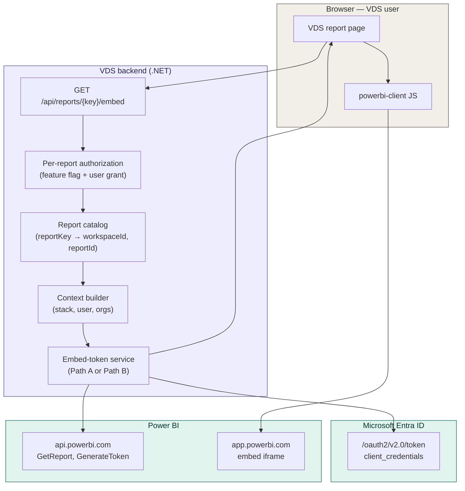
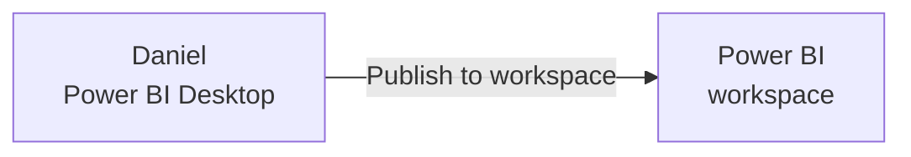
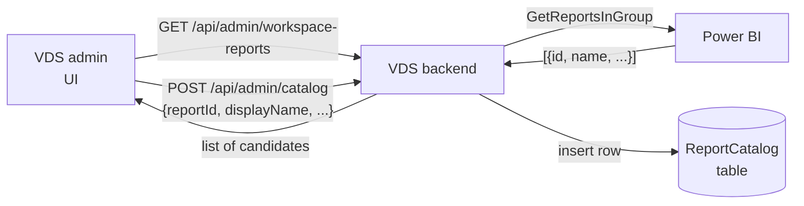
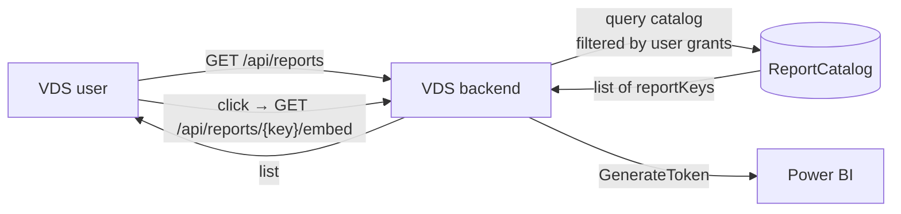

# VEO Intelligence Reporting (VIR) — Implementation Plan

> **Viewing the Mermaid diagrams in this file:**
> - **GitHub** renders them automatically — no setup needed.
> - **VS Code preview** (Ctrl+Shift+V) needs the `bierner.markdown-mermaid` extension. The workspace's [`.vscode/extensions.json`](../../../.vscode/extensions.json) already recommends it; VS Code should prompt on first open. If not, install it manually from the Extensions panel.
> - **Other tools** (Obsidian, Typora, Notion paste, GitLab) — generally support Mermaid out of the box.

> **Work item:** 32081
> **Branch:** `justinpo/32081-vir-implementation-plan`
> **Status:** Pre-spike planning
> **Source materials:**
> - [`Meeting_Summary_20260424.txt`](./Meeting_Summary_20260424.txt) (this folder)
> - [`VEO Intelligence Reporting (VIR)_ Design, Implementation, & Integration Discussion.docx`](./VEO%20Intelligence%20Reporting%20%28VIR%29_%20Design%2C%20Implementation%2C%20%26%20Integration%20Discussion.docx) (this folder)
> - [`VIR_Claude_Implementation_Plan.md`](./VIR_Claude_Implementation_Plan.md) — **superseded** prior plan (PDF / export-API approach); kept for context, see §2
> - Microsoft tutorial: <https://learn.microsoft.com/en-us/power-bi/developer/embedded/embed-customer-app>
> - Sample app: <https://github.com/PowerBiDevCamp/DOTNET5-AppOwnsData-Tutorial>

---

## 1. Purpose

Replace the previous "render Power BI reports as PDF via the export API" plan with the actual integration model the team aligned on in the 04/24/2026 meeting: **VDS embeds interactive Power BI reports** authored by the BI team on top of semantic models with Dynamic Row-Level Security (RLS).

This is the umbrella plan. Two sibling documents describe the implementation paths:

- [`VIR_Implementation_Plan_PathA_Microsoft_SDK.md`](./VIR_Implementation_Plan_PathA_Microsoft_SDK.md) — **Path A**: implement exactly per the Microsoft tutorial using the `Microsoft.Identity.Web` and `Microsoft.PowerBI.Api` NuGet packages.
- [`VIR_Implementation_Plan_PathB_Raw_REST.md`](./VIR_Implementation_Plan_PathB_Raw_REST.md) — **Path B**: bypass the Microsoft SDK wrappers and call Entra ID + Power BI REST endpoints directly with `HttpClient`.

Both paths ship the same product. They differ in what the codebase depends on.

---

## 2. What changed since the previous plan

The previous plan ([`VIR_Claude_Implementation_Plan.md`](./VIR_Claude_Implementation_Plan.md), kept in this folder for reference) targeted **server-rendered PDFs** via Power BI's `ExportToFile` API, parameterised by query-string filters. That plan is wrong for our actual use case — the 04/24 meeting clarified the BI team is publishing semantic models with Dynamic RLS for **interactive embedded** consumption, not export jobs.

| Previous assumption | Actual direction |
|---|---|
| Server renders a PDF, returns `application/pdf` | Browser embeds an **interactive** Power BI report (iframe or new tab) |
| Filters are passed as URL query parameters | A small **context payload** (user/org IDs) is passed to the report; **Dynamic RLS** in the semantic model does the filtering |
| Per-report parameter shape configured in admin | **One consistent payload shape** for every report (Rob's call — admins don't define per-report fields) |
| Export-to-File API + polling + download | `GenerateToken` → embed token → `powerbi-client` JS SDK in browser |
| Per-report `ReportDefinition` with typed parameters | Per-report **catalog entry**: `(reportKey, workspaceId, reportId, displayName, accessFlags)` only |

Parts of the existing Figma board no longer apply (PDF caching boxes, 429 handling on export, per-report parameter forms). The right side of the board (VDS admin / VDS manager assignment) is still relevant.

---

## 3. Decision summary (from 04/24 meeting)

### 3.1 Implementation path chosen

Of the three options discussed:

1. **Separate reporting portal, VDS as OIDC auth provider** — too heavy; requires a full OIDC service in VDS that's not on the roadmap.
2. **VDS *is* the reporting portal, calls Power BI directly** — ✅ **chosen**.
3. **Fully external portal owned by Daniel's team** — Sales/Ryan want everything inside VDS long-term; rejected as the target state. Possibly viable as a stop-gap.

### 3.2 Power BI integration model

**App-owns-data (a.k.a. embed-for-your-customers).** End users do not need Power BI logins. VDS authenticates as a service principal, generates an embed token per request, and the browser uses `powerbi-client` to render the report inside VDS.

```
Browser (VDS UI)              VDS backend                Entra ID            Power BI
      │                            │                       │                    │
      │── GET /reports/{key}/embed─►                       │                    │
      │                            │── client_credentials ►│                    │
      │                            │◄── access_token ──────│                    │
      │                            │── GetReport ─────────────────────────────► │
      │                            │── GenerateToken (RLS effective identity) ►│
      │                            │◄── { embedUrl, embedToken, reportId } ────│
      │◄── { embedUrl, token, … } ─┤                                            │
      │                            │                                            │
      │── powerbi.embed(config) ─────────── iframe to app.powerbi.com ────────► │
      │◄── interactive report ─────────────────────────────────────────────────│
```

### 3.3 Filtering

- Authored on the **semantic model** as **Dynamic RLS**.
- VDS passes an **effective identity** in the embed token request: roles + identity blob (user ID and/or org IDs).
- The semantic model's RLS rules read those values via the `USERPRINCIPALNAME()` / `USERNAME()` DAX functions (or whatever Daniel defines) and filter row-by-row.
- The browser cannot bypass this — RLS is enforced server-side at the dataset.

### 3.4 Context payload

Rob's directive: **one shape, used for every report.** Admins should not configure per-report parameter sets. The payload starts as:

```json
{
  "userId": "<VDS user ID, scoped to the launching stack>",
  "userEmail": "<email — fragile across stacks; see §5.1>",
  "stack": "wbs | eplan",
  "accountOrgIds": ["<orgGuid>", "..."],
  "primaryAccountOrgId": "<orgGuid>"
}
```

If a future report needs an additional field, we add it to the payload — every report sees it whether or not it uses it. We never trim per-report.

---

## 4. Architecture overview



The **only piece that differs between Path A and Path B** is the `Token` box: how we acquire the Entra token and call `GenerateToken`. Everything else is identical.

---

## 4a. Report discovery and the catalog model

A natural question: do we hard-code each report's `(workspaceId, reportId)` in VDS, or can VDS ask Power BI what's in the workspace? The Power BI REST API supports both reading a list of workspaces (`GET /v1.0/myorg/groups`) and listing reports within a workspace (`GET /v1.0/myorg/groups/{ws}/reports`). That covers raw discovery. The architectural question is what to do with it.

> The 04/24 meeting already foreshadowed this:
> *Justin:* "is there a way for us to … see what's in the workspace on Power BI of like possible reports?"
> *Rob:* "It would be good to know if that discovery exists, but I'm planning for us to have admin manually enter those in VO admin right now in the design, but it would be really nice to know if they have that."
>
> Rob's instinct is the right answer — discovery is the admin's capability, not the end user's. The catalog is the gate.

### 4a.1 Three options, only one of which fits VDS

| | Pure discovery | Hard-coded in code | **Catalog + discovery (recommended)** |
|---|---|---|---|
| Where do report IDs live? | Nowhere — fetched live | In source | Small VDS catalog row per exposed report |
| Who controls what users see? | SP workspace membership | Whoever deploys code | VDS admin via UI |
| Daniel publishes a draft | Immediately visible to users | Invisible until code change | Visible only after admin promotes it |
| Display name independent of PBI report name | ❌ | ✅ | ✅ |
| Admin picker uses discovery? | N/A | N/A | ✅ — that's its main job |
| New report goes live without dev | ✅ Too easy — no gate | ❌ | ✅ One admin action |
| Per-user / per-org access control | Bolt-on | Bolt-on | First-class — fits the catalog row |

Pure discovery exposes whatever Daniel publishes the moment he publishes it, including drafts. Hard-coding makes Daniel wait on a VDS deploy for every new report. The hybrid is the only one that matches the meeting's "VDS admin assigns reports" design from the Figma.

### 4a.2 Catalog row shape

```csharp
public sealed record ReportCatalogEntry(
    string  ReportKey,           // VDS-stable identifier (e.g. "sales-by-region")
    Guid    WorkspaceId,
    Guid    ReportId,            // from Power BI — fetched via discovery once, stored
    Guid    DatasetId,           // ditto — stored so we don't re-fetch on every embed call
    string  DisplayName,         // VDS-controlled, independent of Power BI report name
    string? Description,
    string? Category,            // for grouping in the UI
    bool    IsActive,            // soft-disable without deleting
    string  RequiredFeatureFlag, // gate at the org / stack level
    string  RequiredAccessRole); // gate at the user level
```

Notes on the shape:

- `ReportId` and `DatasetId` are **denormalised in from Power BI at the time of catalog insertion**, not looked up on every embed. They're effectively foreign keys into Power BI; if Daniel deletes and recreates a report (changing its GUID), the admin re-points the catalog entry. Rare; cleanly handled.
- `DisplayName` decouples the user-facing label from whatever Daniel called the `.pbix` file. Daniel can rename freely on his side.
- `RequiredFeatureFlag` + `RequiredAccessRole` cover layers 1–2 of the authorization model from §5.5. RLS (layer 3) is the semantic model's job.

### 4a.3 The three flows

**Daniel publishes a report** (no VDS involvement):



**VDS admin promotes it** (uses discovery):



**End user views a report** (catalog-only — discovery is not on this path):



Discovery is **only** on the admin path. The end-user path is catalog-only — fast, cacheable, no Power BI round-trip until the embed itself.

### 4a.4 Discovery endpoints to expose in VDS

```
GET  /api/admin/workspaces                        # for picking which workspace
GET  /api/admin/workspaces/{ws}/reports           # candidates for the catalog
POST /api/admin/catalog                           # add a row
PUT  /api/admin/catalog/{reportKey}               # edit a row
DELETE /api/admin/catalog/{reportKey}             # remove (or soft-disable via IsActive)
```

The admin endpoints sit behind a stronger authorization policy than `/api/reports/{key}/embed` — only VDS admins, not regular VDS users.

### 4a.5 Validation at admin-add time (and in CI)

When the admin adds a catalog entry, validate against Power BI:

1. The `workspaceId` is one VDS is configured to use (allowlist).
2. The `reportId` exists in that workspace.
3. The dataset has the expected RLS roles defined (otherwise the admin gets a warning that effective-identity won't filter anything).

Each is a single SDK / REST call. Failing to validate at admin-add time means a silent runtime failure later.

A nightly job can re-validate the catalog against the workspace and flag rows whose `reportId` no longer exists — catches Daniel deleting a report without telling anyone.

---

## 5. Open questions and decisions

### 5.1 Multi-stack identity (WBS vs ePlan)

VDS runs across two stacks. The same person typically has different user IDs in each, and emails are forcibly unique within a stack but not guaranteed to match across stacks.

**Working decision:** scope each report session to the stack the user launched from. The payload includes `stack`. The semantic model's RLS rules filter by `(stack, userId)` or `(stack, accountOrgIds)`.

**Deferred:** cross-stack aggregation for users whose email matches across stacks. Daniel Krisher noted the data warehouse already contains both stacks; we can revisit once single-stack works.

### 5.2 Single-org vs multi-org payload

VDS proper is normally scoped to one active builder/account-org. Reports may be more useful aggregated across orgs the user has access to.

**Working decision:** payload carries `accountOrgIds: string[]` (multi) **and** `primaryAccountOrgId: string` (the currently-selected one). RLS rules can use whichever is appropriate per report.

### 5.3 Workspaces

- **Minimum:** one dev workspace, one prod workspace. Lets Daniel publish/iterate without touching prod.
- **Per-stack split:** deferred. The team will likely run AFI/CCDI without the reporting feature flag enabled initially.
- **Per-environment Entra apps:** likely follow the OIDC pattern (separate app registration per environment). DevOps owns this.

### 5.4 Capacity

Power BI **export-and-embed flows require Premium / Premium Per User (PPU) / Fabric capacity**. Shared capacity won't work. This is a procurement item — Aaron / Shelby / Cole on DevOps need to be in the conversation.

### 5.5 Authorization layering

Three layers, all required:

1. **Feature flag** — does this org/stack have the reporting feature enabled?
2. **Per-user grant** — has VDS admin assigned this user this report?
3. **Dataset RLS** — what data within the report can the user actually see?

Layers 1–2 live in VDS code. Layer 3 lives in the semantic model and is enforced by Power BI. **The service principal bypasses RLS by default** — VDS *must* supply the effective identity in `GenerateToken`, otherwise the user sees everything.

---

## 5a. Team responsibility matrix

Three parties touch this feature; none of them owns the whole thing. Friction here usually shows up as 403s, empty workspace lists, or "RLS isn't filtering anything" — symptoms that look like VDS bugs but are almost always upstream config gaps. Use this as the punch-list when something fails.

| Concern | DevOps (Aaron) | BI team (Daniel) | VDS team (Justin) |
|---|:---:|:---:|:---:|
| **Entra ID** | | | |
| Register the "VDS Reporting" Entra app | ✅ | | |
| Grant Power BI API permissions on the app | ✅ | | |
| Admin-consent the permissions | ✅ | | |
| Manage the client secret / certificate (rotate, store in Key Vault) | ✅ | | |
| Tenant setting "Service principals can use Power BI APIs" → enabled for the SP's security group | ✅ | | |
| **Power BI** | | | |
| Purchase + assign Premium / PPU / Fabric capacity | ✅ | | |
| Create the workspace(s) (dev, prod, possibly per-stack) | | ✅ | |
| Assign capacity to each workspace | ✅ | (coordinate) | |
| **Add the service principal as a workspace Member** | | ✅ | |
| Author the semantic model | | ✅ | |
| Define RLS roles + DAX filter expressions in the semantic model | | ✅ | |
| Publish reports to the workspace | | ✅ | |
| Communicate the RLS contract (role names, what `username`/`customData` should contain) | | ✅ | (consume) |
| **VDS** | | | |
| Implement embed-token service (Path A or B) | | | ✅ |
| Implement catalog + admin UI for promoting reports | | | ✅ |
| Implement per-user / per-org authorization (feature flags + grants) | | | ✅ |
| Build the effective identity from the VDS session | | | ✅ |
| Wire `appsettings.json` and Key Vault references | (provision) | | ✅ (consume) |
| End-user authentication (already in place) | | | ✅ |

### 5a.1 Symptoms-to-owner map

When something breaks, this is the routing table:

| Symptom | Most likely root cause | Whose box |
|---|---|---|
| 401 from Entra during token acquisition | Wrong client secret, expired secret, wrong tenant | DevOps |
| 403 from Power BI on `GenerateToken` or `GetReport` | SP not a workspace Member, **or** tenant setting not enabled, **or** workspace not on capacity | DevOps (tenant + capacity) / BI team (workspace membership) |
| 403 specifically with "PowerBINotAuthorizedException" | Tenant setting "Service principals can use Power BI APIs" is off | DevOps |
| `ListWorkspaces` returns empty | SP isn't a Member of *any* workspace | BI team |
| `ListReports` returns empty for a known workspace | SP isn't a Member of *that* workspace | BI team |
| Embed renders, but report shows all rows for every user | Effective identity not sent, **or** semantic model has no RLS roles, **or** role name doesn't match | VDS (identity construction) / BI team (RLS rules) |
| Embed renders, but report shows zero rows | `username` or `customData` value doesn't match what the DAX expects | VDS + BI team — contract mismatch |
| 429 on `GenerateToken` | Capacity throughput cap hit | DevOps (sizing) / VDS (caching) |
| Report ID in catalog returns 404 | Daniel deleted/republished the report; PBI assigned a new GUID | BI team (notify) / VDS (reconcile catalog) |

This is the table to keep open when triaging the spike.

---

## 6. Pre-spike action items

From the 04/24 meeting, owners agreed:

- [ ] **Entra app registration** — Justin checks existing access from the OIDC work; Aaron (DevOps) pulled in. Rob has messaged Aaron.
- [ ] **Working app-owns-data URL** — Daniel Krisher figures out the exact mechanism for producing a no-Power-BI-login URL with RLS filtering active.
- [ ] **Sample report** — Daniel copies an existing report, wires up a semantic model with Dynamic RLS for the spike target.
- [ ] **Developer documentation** — Sam shared the Microsoft tutorial; Daniel sharing YouTube links he watched. Both linked at the top of this file.
- [ ] **Postman call working** — invoke a filtered report (or generate a working embed token) via Postman before any VDS code is written.
- [ ] **Capacity decision** — DevOps to scope SKU. Driven by expected concurrent users + report count.

The spike itself is targeted for the next sprint.

---

## 7. Path A vs Path B — at a glance

| Concern | Path A (Microsoft SDK) | Path B (raw REST) |
|---|---|---|
| **Backend dependencies** | `Microsoft.Identity.Web` + `Microsoft.Identity.Web.UI` + `Microsoft.PowerBI.Api` (transitively pulls ~25 packages) | `System.Net.Http.Json` only (BCL); plus our existing JSON serializer |
| **Time to first token** | Fast — copy/paste from tutorial | Slower — write the OAuth + REST calls ourselves |
| **Maintenance** | Microsoft owns the SDK; we follow their version cadence | We own the HTTP code and any breaking-change adapters |
| **Code surface to read in VDS** | Hidden behind `PowerBIClient` and `ITokenAcquisition` | Explicit `HttpClient` calls — every URL and request body is visible in our repo |
| **Auditability** | Have to trust the SDK on what's actually sent over the wire | Direct: Fiddler-able by reading the code |
| **Token caching** | MSAL handles refresh + in-memory cache automatically | We implement a small singleton cache (~30 lines) |
| **Frontend** | `powerbi-client` (npm) — same in both paths | `powerbi-client` (npm) — same in both paths |
| **Risk** | SDK works fine in MS sample but couples us to their abstractions; harder to escape later | More code we wrote = more surface for bugs in our auth/HTTP layer |

> **About the frontend**: the `powerbi-client` JS package is required for both paths. The browser embed protocol (iframe + `postMessage`) is not documented as a public REST surface; without `powerbi-client` we'd be reverse-engineering a moving target. Path B avoids the *backend* SDK; it does not avoid the JS embed library.

---

## 8. Recommendation

**Spike Path A first.** It exists almost verbatim as a Microsoft sample, so we can have a filtered report rendering in VDS within hours of the Entra app being available. That validates the architecture end-to-end before we argue about dependencies.

**After the spike succeeds, evaluate Path B as a second story.** If by then the Microsoft SDK feels acceptable, ship Path A. If the SDK surface bothers us — package weight, telemetry, .NET version coupling, opinionated ASP.NET wiring — port to Path B. The code that calls `IPowerBIEmbedTokenService` (our own interface, see §9) won't change.

Both plan files target the **same `IPowerBIEmbedTokenService` interface** so the swap is a back-end-only refactor, not a redesign.

---

## 9. Shared interface (path-agnostic)

Both Path A and Path B implement this exact contract. Everything outside the implementation lives in shared code.

```csharp
public interface IPowerBIEmbedTokenService
{
    Task<EmbedTokenResult> GetEmbedTokenAsync(
        Guid workspaceId,
        Guid reportId,
        EffectiveIdentity? effectiveIdentity,
        CancellationToken ct);
}

public sealed record EmbedTokenResult(
    string EmbedUrl,
    string EmbedToken,
    DateTimeOffset ExpiresOn,
    Guid ReportId,
    Guid DatasetId);

public sealed record EffectiveIdentity(
    string Username,                      // typically VDS user ID or email
    IReadOnlyList<string> Roles,          // RLS roles defined in the semantic model
    IReadOnlyList<string> CustomData,     // optional — e.g. account org IDs
    Guid DatasetId);                      // the dataset the identity applies to
```

The DI registration line (`services.AddSingleton<IPowerBIEmbedTokenService, ...>()`) is the only place that decides which path is in use. Each path doc shows its own concrete class.

---

## 10. Implementation order (spike-then-ship)

1. **Pre-spike (current sprint)** — action items in §6.
2. **Spike (next sprint)** — Path A walking skeleton:
   - Hard-coded `workspaceId` + `reportId` from Daniel's sample report.
   - Hard-coded effective identity (one test user, one org).
   - Single GET endpoint returning `EmbedTokenResult`.
   - Minimal Razor/React page that loads `powerbi-client` and embeds.
   - **Success:** filtered interactive report renders inside VDS for an authenticated VDS user.
3. **Story 1** — Catalog + per-user authorization (feature flag, admin-assigned report grants).
4. **Story 2** — Real effective identity built from VDS session (stack, user, orgs).
5. **Story 3** — Discovery endpoint (list reports the user can see) + dynamic UI page.
6. **Story 4 (optional)** — Path B port if the team decides to drop the Microsoft SDK.
7. **Story 5** — Operational hardening: token cache observability, embed token refresh in browser, audit logging, RLS bypass tests.

---

## 11. Reference: Microsoft tutorial steps mapped to our work

| Tutorial step | Our equivalent |
|---|---|
| 1. Configure Entra app + service principal | DevOps + Justin (pre-spike) |
| 2. Get embedding parameter values (tenant/client/secret/workspace/report IDs) | Stored in our existing config layer (Key Vault for secrets) |
| 3. Add NuGet packages | Path A only — see Path A doc; Path B uses BCL `HttpClient` |
| 4. Server-side auth | Path A: `Microsoft.Identity.Web` startup wiring. Path B: custom `IConfidentialClientApplication`-equivalent (~50 LOC) |
| 5. Client-side embed (`powerbi-client`) | Identical in both paths |
| 6. Run the app | Identical |

---

## 12. Glossary

- **App-owns-data / embed-for-your-customers** — embed pattern where the app authenticates as a service principal; end users don't need Power BI licenses.
- **Service principal (SP)** — non-human Entra identity representing VDS. Has no per-row data permissions of its own; gets workspace access granted by the workspace admin.
- **Semantic model** — the Power BI data model (formerly called *dataset*). Holds tables, relationships, measures, and RLS rules. Reports sit on top of one.
- **Dynamic RLS** — RLS where the filter expression evaluates the *current effective identity* at query time (e.g. `[OrgId] = USERNAME()`), as opposed to static role assignments.
- **Effective identity** — the `(username, roles, customData, datasetId)` blob VDS sends to `GenerateToken`. Power BI substitutes it into RLS DAX evaluation for the embedded session.
- **Embed token** — short-lived (1h max) bearer token specific to one user × one report × one identity. Different from an Entra access token.
- **Capacity (Premium / PPU / Fabric)** — paid Power BI compute. Embed-for-customers requires it.
- **Workspace** — Power BI's unit of organizing reports + datasets + permissions. Shared between dev and prod is not allowed in our design — minimum one workspace per environment.

---

## 13. Out of scope

These were called out and explicitly deferred:

- PDF rendering / scheduled emails. (Replaced by interactive embed.)
- Per-report parameter forms. (Replaced by uniform context payload.)
- OIDC service in VDS. (Path 1 from the meeting — too heavy for current roadmap.)
- Per-stack Power BI workspaces beyond dev/prod. (Revisit if AFI/CCDI monetization requires it.)
- Cross-stack identity bridging via email. (Risky; revisit after single-stack works.)
- Bookmarks and Power BI URL filters as the filtering mechanism. (RLS in semantic model is the contract.)
