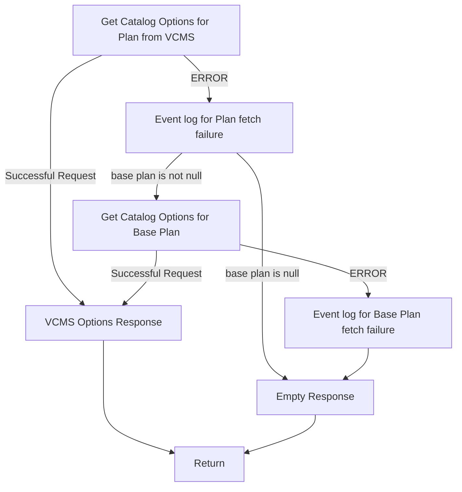

```mermaid
flowchart TD
    A["Get Catalog Options for Plan from VCMS"]
    X["VCMS Options Response"]
    Y["Empty Response"]
    Z["Return"]
    A --> |"Successful Request"| X
    A --> |"ERROR"| C["Event log for Plan fetch failure"]
    C --> |"base plan is null"| Y
    C --> |"base plan is not null"| D["Get Catalog Options for Base Plan"]
    D --> |"ERROR"| E["Event log for Base Plan fetch failure"] 
    E --> Y
    D --> |"Successful Request"| X
    X --> Z
    Y --> Z
```